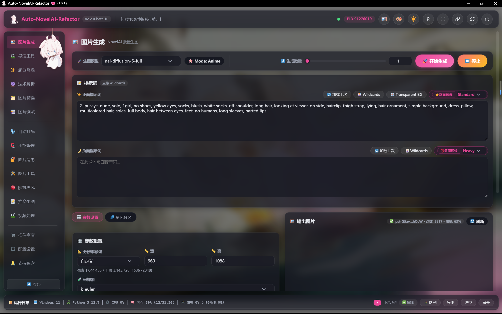

<p align="center">
  
</p>


## 💬 介绍

- 一款 NovelAI 批量生成工具, 更好的 NovelAI 体验!

- [Semi-Auto-NovelAI-to-Pixiv](https://github.com/zhulinyv/Semi-Auto-NovelAI-to-Pixiv) (SANP) → [Auto-NovelAI-Refactor](https://github.com/zhulinyv/Auto-NovelAI-Refactor) (ANR-gradio) → [**Auto-NovelAI-Refactor**](https://github.com/zhulinyv/Auto-NovelAI-Refactor) (ANR-webui), 一步比一步更好用

- **使用中遇到问题请加 QQ 群咨询：[704064019](https://qm.qq.com/cgi-bin/qm/qr?k=704064019)**


## ✨ 特性

- 🚀 **全模型生图** — 支持 NAI5 / 4.5 / 4 / 3 / Furry 共 8 个模型, 文生图 · 图生图 · 局部重绘 · 涂鸦重绘 · 角色参考 · 风格迁移 (Vibe) 全覆盖; 分辨率预设 / 采样器 / 调度器 / 步数 / 引导系数 / 重采样 / 种子 / Variety+ / Decrisp / SMEA / DYN / Legacy UC 等参数按模型自动联动显隐
- 👥 **角色分区与参考** — 5×5 网格或 NAI5 自由拖拽放置角色 (最多 32 个), 每个角色独立正负面提示词; 角色参考支持强度 / 保真度 / 三种参考模式
- 🎨 **内置画板** — 图生图与重绘自带画笔 / 橡皮 / 矩形 / 椭圆 / 套索 / 裁剪工具, 撤销重做、滚轮缩放、裁剪重绘自动对齐官网生成块规则
- 🚦 **多 Token 生图队列** — 每个 Token 一条独立通道并行生成, 通道各自冷却; 任务可排队 / 取消 / 上移下移置顶 / 单独停止 / 清空; 通道状态与排队位次实时推送
- 🛡️ **稳定省心** — 429 限流开启后无限自动重试, 其余错误自动重试 3 次; 剩余点数 (Anlas) 按 Token 实时显示订阅状态、用量与恢复倒计时, 低于阈值自动邮件或站内提醒
- 🎬 **导演工具** — 去背景 (一次返回 3 张) / 线稿 / 素描 / 上色 / 表情 (24 种情绪 × 6 档强度) / 清理杂物走 NovelAI 官方接口, 另有浏览器本地执行的 Pixel Snap 像素化
- ✨ **超分降噪** — realcugan-ncnn-vulkan / Anime4KCPP / waifu2x-caffe 三引擎可选, 首次使用自动下载, 批量处理并自动回填原始生成元数据
- 🔮 **法术解析** — 读取 PNG / WebP / JPG 中的 NovelAI 隐写与 EXIF 元数据, 一键把种子步数提示词等参数送回生成页; 内置 wd-tagger 图片反推 (12 个模型, 云端推理不占本地显存)
- 📚 **图片浏览与筛选** — 输出目录树 + WebP 缩略图滚动加载 + 多种排序 + 收藏夹 + 回收站删除; 图片筛选支持批量移动 / 复制 / 删除, 并可无限撤销
- 🃏 **卡片库与通配符** — `<分类:名称>` 语法递归展开, 内置 随机 / 顺序 两种特殊卡; 卡片支持封面、搜索、多选、Shift 范围选择、拖拽插入提示词; 自带 8 个中文词条包
- 🏷️ **中英提示词助手** — 13 MB Danbooru 中文标签库自动补全 (类别着色 / 别名 / 热度), 21 个免 Key 在线翻译源自动容错切换; 内置 8 组常用标签与提示词库收藏; 提示词标签块可拖拽排序、逐条加减权重
- 🧩 **插件系统** — 声明式面板清单, 前端自动渲染表单: 17 种字段类型、条件显示、并排分栏、图表联动; 动作可直连生图队列或本地多线程; 内置 7 个插件 (图片工具 / 自动打码 / 图片混淆 / 压缩整理 / 随机画风 / 推文生图 / 视频处理), 商店一键安装卸载启停更新
- 📜 **实时日志** — 底部日志面板经 SSE 与后端同步 (共享链接下自动降级为轮询), 级别着色、异常堆栈可展开、支持导出; CPU / 内存 / GPU / Python 版本实时显示
- ⚙️ **即时配置** — 配置保存在 settings.json, 除端口外修改后立即生效; 首次启动自动从旧版 .env 迁移; 自定义输出路径模板、代理、共享链接 (cloudflared 内网穿透) 一应俱全
- 🎀 **可爱外观** — 深浅色一键切换, 7 套主题色 + 自定义调色, 背景模糊可调; 壁纸支持本地上传 / Bing 每日 / 动漫随机 / 文件夹轮播 (带作品 PID 跳转); 顶栏一言、启动与完成提示音、晴天娃娃挂件与彩蛋
- 🪶 **轻量好用** — 后端 FastAPI + SSE 事件流, 前端零构建的模块化原生 JS: 无需 Node / npm, 无需 GPU, 启动快占用低; 双击 run.bat 自动装依赖建环境并打开浏览器, 托盘常驻、隐藏终端、一键重启 / 更新 / 退出

## 🎞️ 实机演示




## 💿 部署

### 💻 配置需求

- 极低的配置需求, 极致的用户体验!

| 项目 | 说明 |
|:---:|:---:|
| NovelAI 会员 | 为了无限生成图片, 建议 25$/month 会员 |
| 网络代理 | 为了成功发送请求, 确保你可以正常访问相关网站 |
| Python | 3.10 及以上版本 |
| 操作系统 | 跨平台运行; 仅超分降噪引擎需要 Windows |


### 🎉 开始部署

#### 0️⃣ Star 本项目

- 如果你喜欢这个项目，请不妨点个 Star🌟，这是对开发者最大的动力

#### 1️⃣ 安装 Python 与 Git

- 推荐安装 3.10 及以上版本, 安装时注意勾选将 Python 添加到环境变量 [https://www.python.org/downloads/](https://www.python.org/downloads/)
- 推荐安装最新版本 Git [https://git-scm.com/downloads](https://git-scm.com/downloads)

#### 2️⃣ 克隆 ANR-WebUI 分支

- 打开 cmd 或 powershell, 执行 `git clone https://github.com/zhulinyv/Auto-NovelAI-Refactor.git`

#### 3️⃣ 运行与使用

- 双击运行 `run.bat` 即可: 缺少依赖时会自动安装, 克隆完仓库直接运行就能使用
- 启动后浏览器会自动打开 [http://127.0.0.1:11451](http://127.0.0.1:11451)
- **非 Windows 操作系统**请手动启动: 先 `pip install -r requirements.txt`, 再执行 `python -X utf8 main.py`

#### 4️⃣ 整合包下载

- 如果上述操作你觉得难以上手或出现问题, 请加群下载整合包, 解压即用


## ⚙️ 配置

- ⚠️ 1. 启动后进入 **⚙️ 配置设置** 页面填写 NovelAI Token 并保存, **除端口外所有配置修改后立即生效, 无需重启**; 每个配置项旁都有说明提示, 请不要跳过这一步

- ⚠️ 2. **多 Token 并行**: Token 每行填写一个, Token 数量 = 同时执行的生图任务数 (生图队列通道数)

- ⚠️ 3. 配置持久化到 `settings.json`; 如果你用过旧版本, 首次启动会自动从 `.env` 迁移 Token 等配置

⚠️ token 的获取:

- 


## 🧩 插件

### 插件商店

- **🛒 插件商店** 页面可以在线安装 / 卸载 / 启停 / 更新插件, 插件清单见 [`assets/plugins.json`](assets/plugins.json), 欢迎提交你的插件

- 内置插件 (见功能一览) 随项目发布, 也可通过商店启停或更新

### 插件开发

插件是 `plugins/` 下的一个目录 (或单文件), 在 `__init__.py` 中导出 `register(plugin)`:

```python
from utils.plugins import Action, Field, Panel, Plugin


def register(plugin: Plugin):
    plugin.title = "我的插件"
    plugin.panels.append(
        Panel(
            id="my_panel",
            title="我的面板",
            icon="🌸",
            fields=[Field(id="text", label="输入", type="textarea", autocomplete=True)],
            actions=[Action(id="run", label="执行", inputs=["text"], handler=my_handler)],
        )
    )
```

- **字段类型**: `text / textarea / number / slider / checkbox / checkbox_group / radio / select / path / image / filearea / color / info / toggle / chart` 等, 支持 `show_if` 条件显示、`row_group` 并排、`sync` 联动、提示词自动补全 (`autocomplete`)、左右分栏 (`column`) 等
- **动作路由**: `uses_novelai=True` 的动作进入生图队列 (排队 / 冷却 / 多 Token 并发), 其余走本地多线程立即执行
- **返回值**: 处理函数返回字典 (`{"text": ..., "images": [...], "image": ...}`)、字符串, 或**生成器**


## 🤝 鸣谢

本项目使用 [SmilingWolf/wd-tagger](https://huggingface.co/spaces/SmilingWolf/wd-tagger) 反推提示词

本项目使用 [novelai-image-metadata](https://github.com/NovelAI/novelai-image-metadata) 读取与修改元数据

本项目使用 [realcugan-ncnn-vulkan](https://github.com/nihui/realcugan-ncnn-vulkan) | [Anime4KCPP](https://github.com/TianZerL/Anime4KCPP) | [waifu2x-caffe](https://github.com/lltcggie/waifu2x-caffe) 超分降噪图片

本项目使用 [Semi-Auto-NovelAI-to-Pixiv](https://github.com/zhulinyv/Semi-Auto-NovelAI-to-Pixiv) 的部分源代码

本项目使用 [Lolicon API](https://docs.api.lolicon.app) | [Hitokoto 一言](https://hitokoto.cn) | [Bing 每日壁纸](https://www.bing.com) | [Picsum](https://picsum.photos) 提供背景和一言服务


## 🔊 声明

免责声明: **本软件仅提供技术服务，开发者不对用户使用本软件可能引发的任何法律责任或损失承担责任, 用户应对其使用本软件及其结果负全部责任**

<p align="center" >
  <a href="https://github.com/zhulinyv/Auto-NovelAI-Refactor/blob/main/CODE_OF_CONDUCT.md"><b>Code of conduct</b></a> | <a href="https://github.com/zhulinyv/Auto-NovelAI-Refactor/blob/main/LICENSE"><b>LICENSE</b></a> | <a href="https://github.com/zhulinyv/Auto-NovelAI-Refactor/blob/main/SECURITY.md"><b>Security</b></a>
</p>

<hr>
</img>
